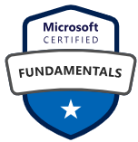

# Hi 👋, I'm Rohan Patel

I am a passionate Data Engineer with over 5 years of experience turning raw data into meaningful insights. I work with modern tools like Azure Data Factory, Databricks, Azure Synapse Analytics, Delta Lake, DBT and the Data Lakehouse to build efficient data pipelines and solutions in the cloud. Currently upskilling in AI/ML, Deep Learning, MLOps & Generative AI (LLMs, RAG). I love learning and continuously improving my skills to stay up-to-date with the latest in the field.

---

## Certifications

Click a badge to view the verification for that certificate.

  
  
  
  
  

---

## Languages & Tools

  
  
  
  
  
  
  
  
  
  
  
  
  
  

---
